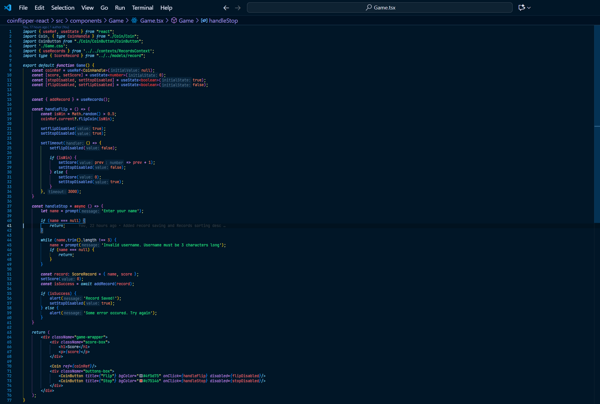
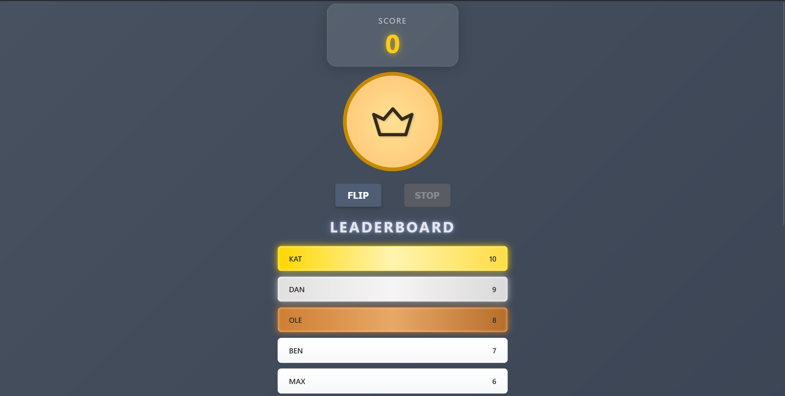

## Requirements
- Pick API for fetching data (something in a list) and create a SomethingList component (characterList, moviesList, etc)  
- Add a load button. When clicked, it should fetch data  
- After fetching, display your data inside an unordered list, pass via props to SomethingCard component (characterCard, movieCard, etc)  
- Use css to display items neatly. Component list and component card css must have separate css applied  

## Screenshots
### Game Component Code


### App


## Setup
### Clone Repo
```
git clone https://github.com/Arlan-Z/kbtu-react-api-task
cd kbtu-react-api-task
```

### Install Packages
```
npm run install-all
```

### Start App
```
npm run dev
```